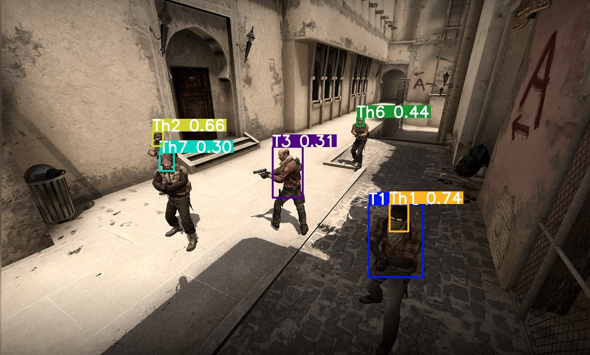
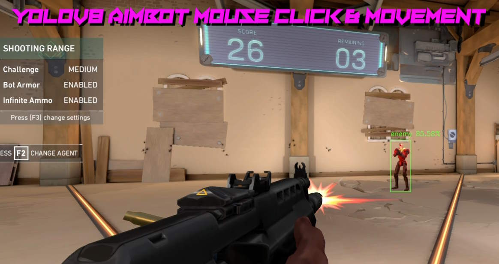
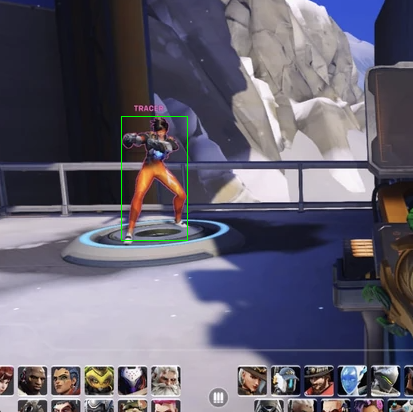
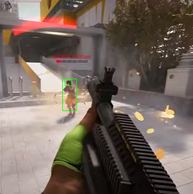

# UltraAImer

**UltraAImer** is an advanced AI-powered aimbot designed for enhancing precision and accuracy in video games. Built using cutting-edge machine learning algorithms, UltraAImer offers high-speed targeting with exceptional reliability, taking your gaming experience to a whole new level.

## Features

- **Dual Detection Modes**: 
  - YOLO AI-powered detection for precise target identification
  - Color-based detection for lightweight performance
- **Advanced Mouse Movement**:
  - Anti-detection movement patterns using bezier curves
  - Hardware mouse modifier support (KmNet/KmBoxB/COM port)
  - Multiple movement options including WinAPI and SendInput
- **Customizable Settings**: Offers adjustable parameters for speed, sensitivity, and targeting behavior.
- **Low Latency Performance**: Optimized for minimal system impact to ensure smooth gameplay.
- **Multi-Game Support**: Compatible with a variety of popular first-person shooter (FPS) games.
- **Security Focused**: Built with undetectable code design to avoid anti-cheat systems.

## Installation

1. **Clone the repository**:
   ```bash
   git clone https://github.com/yourusername/UltraAImer.git
   cd UltraAImer
   ```

2. **Install dependencies**:
   ```bash
   pip install -r requirements.txt
   ```

3. **Configure settings**:
   - Open `config.ini` in your preferred text editor
   - Adjust the following parameters as needed:
     
     **Mode Section**:
     - `aim`: Choose targeting method ('Yolo' or 'Color')
     - `upper_color`: RGB values (160, 200, 255) for color detection range
     - `lower_color`: RGB values (140, 120, 180) for color detection range
     
     **YOLO Section**:
     - `model_folder`: Directory for model weights (weights)
     - `model`: YOLO model file name (yolov10n.onnx)
     - `img_size`: Input image size (320)
     - `label_off`: Toggle label display (True)
     - `label_tab`: Label tab settings (1)
     
     **KmNet Section**:
     - `ip_address`: Network IP (192.168.2.188)
     - `port`: Network port (8737)
     - `key`: Authentication key (766B5C53)
     
     **Screen Section**:
     - `screenshot_mode`: Screen capture method (dxcam)
     - `auto_detection`: Enable/disable automatic detection (True)
     - `width`: Screen width (2560)
     - `height`: Screen height (1440)
     
     **Mouse Section**:
     - `offset`: Mouse offset (0.25)
     - `moving_type`: Mouse movement method (KmNet)
     - `curve`: Movement curve type (beizer)
     - `mouse_moving_speed`: Movement speed (5)
     
     **COM Section**:
     - `COM_port`: Serial port (COM3)
     - `Bauldrate`: Communication speed (128000)
     
     **PID Section**:
     - `kp`: Proportional gain (0.6)
     - `ki`: Integral gain (0.35)
     - `kd`: Derivative gain (0)
     
     **Key Binds Section**:
     - `key_reload_config`: 0x70
     - `key_toggle_aim`: 0x72  
     - `key_toggle_recoil`: 0x4F
     - `key_exit`: 0x73
     - `key_trigger`: 0x12
     - `key_rapid_fire`: 0x05
     - `aim_keys`: 0x06
     
     **Debug Section**:
     - `enabled`: Toggle debug mode (true)
   
   - Save your changes

4. **Run UltraAImer**:
   ```bash
   python main.py
   ```

## Supported Games

- Counter-Strike: 2

- Valorant

- Apex Legends

- Overwatch 2


- The Finals


- And many more FPS titles

## Disclaimer

UltraAImer is designed for educational and research purposes only. Using aimbots or similar cheating software in online games may violate terms of service and result in account bans. The developers are not responsible for any consequences resulting from the use of this software.

## Contributing

We welcome contributions! Please feel free to submit pull requests, report bugs, or suggest new features. Before contributing:

1. Fork the repository
2. Create a new branch
3. Make your changes
4. Submit a pull request

## Contact

For support, feature requests, or general inquiries:
- Create an issue on GitHub
- Join our Discord server: [\[Discord Invite Link\]](https://discord.gg/VgUsRCB425)
- Email: stingzhang9000@gmail.com
